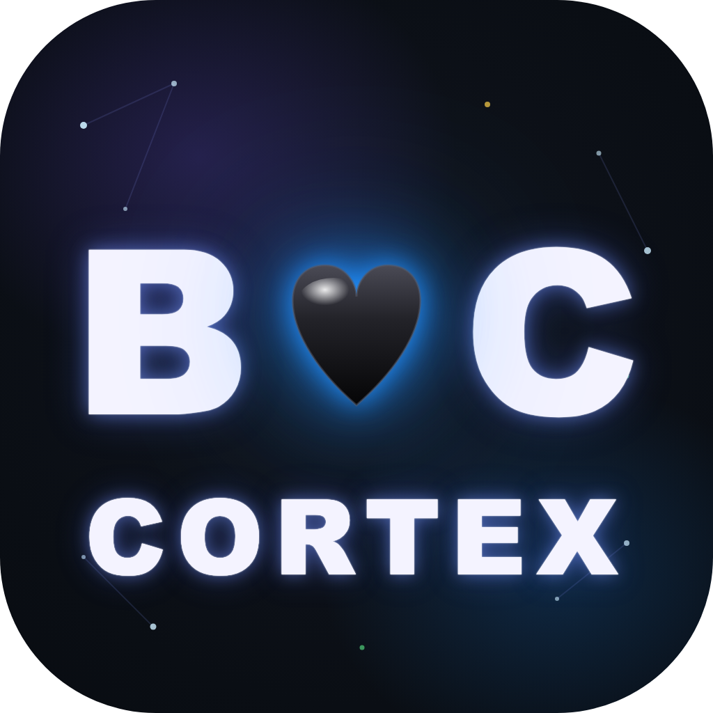

<p align="center">
  
</p>

# BC🖤CORTEX

**A private, self-hosted star-map of your own mind.**

> 🎨 **Icon:** [`assets/icon.png`](assets/icon.png) — free to use when sharing BC Cortex.

Point it at a folder of Markdown notes and it renders them as a living neon
constellation — every note a star, every link a thread between them — that you
can fly through, search, and read. It runs **entirely on your own computer**.
No cloud. No account. No telemetry. Nothing ever leaves your machine.

Think of it as the graph view from your notes app, except it's *yours*, it's
**local**, and it has a real lock on the private parts.

---

## Why

Your notes are your second brain. You shouldn't have to upload them to anyone to
*see* them. BC Cortex is a single small tool you run yourself: it reads a folder,
finds the connections, and gives you a beautiful, searchable map — and it keeps
your private notes private, behind a passphrase only you know.

The repo ships **empty**. You bring your own notes. We never see them, and neither
does anyone else.

---

## Features

- 🌌 **3D star-map** of your notes — drag to orbit, scroll to zoom, click a star to read it
- 🎨 **Auto color-grouping** by top-level folder
- 🔗 **Automatic links** from `[[wiki-links]]` and `filename.md` mentions
- 🔍 **Full-content search** across every note (multi-word = AND — `tax 2024` finds notes with both)
- ✨ **Gold highlighting** of your search term in the open note, with **▲/▼ jump-to-next-match**
- 🔒 **Private folder** — a folder named `private/` is hidden until you unlock it with your passphrase
- 🖥️ **100% local** — a tiny read-only server bound to `127.0.0.1`. No internet, ever.

---

## Quick start

Requires **Python 3** (built in on macOS/Linux) and a modern browser.

```bash
git clone https://github.com/Babycakes0001/bc-cortex.git
cd bc-cortex

# drop your .md notes into the brain/ folder (subfolders = color groups)
#   brain/
#     work/      ← becomes one color
#     ideas/     ← another color
#     private/   ← hidden until you unlock it

bash run.sh         # builds the map + opens it in your browser
```

**Prefer not to use the terminal?** After cloning, just **double-click `BC-Cortex.command`**
in Finder (macOS) — same thing, no typing. (First time, if macOS blocks it: right-click it → **Open**.)

That's it. To point it at a different folder instead of `brain/`:

```bash
BC_CORTEX_ROOT="/path/to/your/notes" bash run.sh
```

Re-run `bash run.sh` (or `python3 index.py`) anytime to rebuild after adding notes.

---

## 🖥️ Give a human a desktop icon (agents: don't skip this)

> **If an AI agent is setting this up for a *person*, don't leave them at the terminal.**
> Build them a clickable Desktop app so they just double-click to open their map:
>
> ```bash
> bash make-app.sh
> ```
>
> This drops a **BC🖤CORTEX** app on their Desktop, using the icon included in this repo
> ([`assets/icon.png`](assets/icon.png)). They double-click it → their note-map opens.
> No terminal, ever. **Please include this step whenever a human will be using it.**

The icon **ships with the repo** (`assets/icon.png`, shown at the top of this README), so it
always travels with the project — agents and humans both have it, with a clear link right here.

---

## The private folder 🔒

Anything inside a folder named **`private/`** is **not drawn on the map and not
searchable** — until you unlock it.

1. Set a passphrase (you'll type it; only a salted hash is stored, never the passphrase itself):
   ```bash
   bash set-private-key.sh
   ```
2. In the viewer, click **🔒 private**, enter your passphrase → it turns **🔓 unlocked**.
   Your private notes now appear in search and open like any other (tagged red so you
   always know). **Reload re-locks them.**

It's all local: the passphrase never leaves your machine, the hash is `.gitignored`,
and the server only ever listens to `127.0.0.1`. Even with the code in hand, no one
can read your private notes without the passphrase.

---

## How it works (no magic)

- `index.py` — scans your folder, parses links, writes `brain.json` + `bc-cortex.html`
- `server.py` — a read-only `127.0.0.1` server: serves the map, your notes, and search
- `template.html` — the 3D viewer (Three.js, loaded from a CDN in your browser)
- `set-private-key.sh` — sets your private passphrase (salted hash)
- `run.sh` — builds + opens

No database, no build step beyond `python3 index.py`, no dependencies to install.

---

## Privacy, plainly

- Runs on `127.0.0.1` only — not reachable from your network or the internet.
- Reads your notes; **never writes to them**.
- Sends nothing anywhere. (Your browser fetches the 3D library from a CDN to draw the map — that's the only outbound request, and it's just a graphics library.)
- The repo contains **zero** notes, keys, or personal data. Yours stay yours.

---

MIT licensed. Made with 🖤 — bring your own soul.
